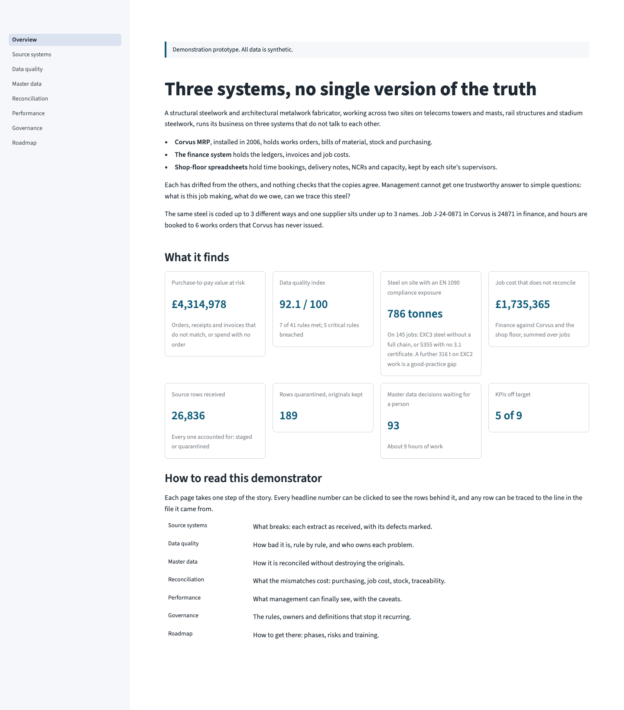
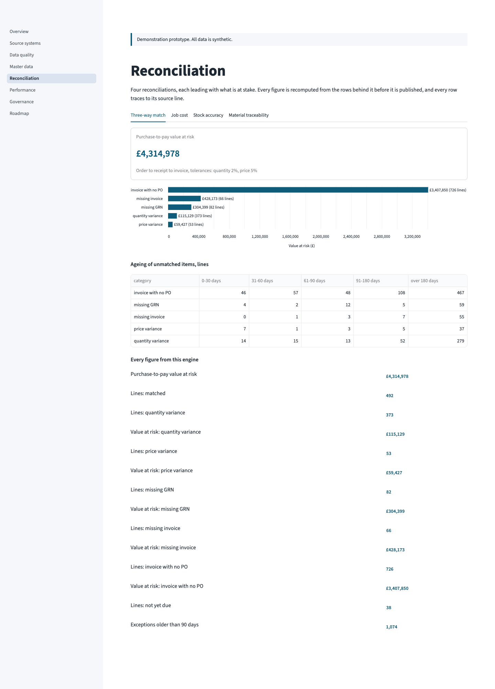

<!-- Generated by `make readme` from docs/templates/readme.md: edit the template, not this file. Every number below is filled from a warehouse query, a setting or a committed document, and `make audit` checks each one. -->
# FabSync

Systems integration, data governance and management reporting demonstrator for a fictional UK structural
steelwork and architectural metalwork fabricator.

**All data is synthetic.** The company, its sites, customers, suppliers, staff, jobs and every figure are
invented. No real company, contract, person or supplier is represented. How the data is made is set out
below.

## What this is

FabSync takes the records of a fabricator whose systems do not agree, and shows, in order:

1. **What breaks** when three systems hold overlapping records and nothing keeps them in step.
2. **How to reconcile** them without destroying the originals.
3. **What governance rules** stop the problems coming back.
4. **What management can finally see** once it is fixed, and a plan to get there.

It is a working prototype: a DuckDB warehouse built from the source extracts, master data matching, 41
declared data quality rules, four reconciliations, nine documented KPIs, a Streamlit app
that tells the story page by page, and an A4 management pack. Every number in the pack, on the app's Overview
page and in this README is traced back to the query, setting or document it came from
(`docs/traceability-audit.md`).



*The Overview page.*



*The Reconciliation page, on the three-way match.*

## The business problem

The company fabricates structural steel, telecoms towers and masts, rail structures and stadium steelwork at
two sites, Wakefield and Teesside. It runs on three systems that were never joined up:

- **Corvus MRP**, an ageing MRPII system, holds works orders, bills of material, stock and purchasing. It has
  no supplier list and records no issue of steel to jobs.
- **The finance system** holds the ledgers, supplier accounts, invoices and job costs, under its own job
  numbering: job J-24-0871 in Corvus is 24871 in finance.
- **Shop-floor spreadsheets**, kept by each site's supervisors, hold time bookings, delivery notes,
  non-conformance reports (NCRs) and weekly capacity.

The same steel is coded several ways, one supplier sits under several accounts, hours are booked to works
orders Corvus never issued, and invoices are checked against orders and deliveries by eye. Management cannot
get one trustworthy answer to simple questions: what is this job making, what do we owe, and can we trace
this steel to its mill certificate, as EN 1090 requires on EXC3 and EXC4 work?

## Run it

Needs Python 3.11 or later and `make`. From a fresh clone:

```sh
make pack   # install, generate the data, build the warehouse, run every stage, write the pack
make app    # open the demonstrator at http://localhost:8501
```

`make pack` is the one command: it creates a virtual environment in `.venv`, installs the dependencies,
generates the synthetic extracts, builds the warehouse from empty, runs matching, the data quality rules, the
reconciliations and the KPIs, and writes `export/fabsync-management-pack.pdf`, with every chart as a PNG in
`export/figures/` for slides. From a fresh clone, `make run-all && make pack` took 56.8 seconds,
including the dependency install (measured in `docs/progress.md`). The first run needs a network connection to
install the dependencies; after that everything runs offline, with no cloud services, API keys or network
calls. Rebuilding gives byte-identical files.

`make run-all && make pack` runs the pipeline twice, because the pack always rebuilds from a clean run so that
it cannot lag the data; `make pack` alone does everything.

| Command | What it does |
| --- | --- |
| `make generate` | Create the synthetic source extracts in `data/raw/` |
| `make ingest` | Rebuild the DuckDB warehouse: raw, staging, core, lineage, quarantine, profiling |
| `make match` | Match materials, suppliers, jobs and works orders across the systems |
| `make quality` | Run the declared data quality rules; write the scorecard and exception queue |
| `make reconcile` | Three-way match, job cost, stock accuracy and material traceability |
| `make kpi` | Build the documented KPI views; write the data dictionary and KPI report |
| `make run-all` | Every stage above, in order |
| `make app` | Launch the Streamlit demonstrator |
| `make pack` | From a clean run, the management pack PDF and its charts, and this README |
| `make readme` | Refill this README from `docs/templates/readme.md` |
| `make audit` | Build the pack, then trace every number in it, on the Overview page and in this README to its source |
| `make test` | Run the test suite |
| `make coverage` | Run the suite under coverage.py and report line and branch coverage |
| `make diagrams` | Refill the design diagrams with measured figures and render them (needs the Mermaid renderer, `mmdc`) |
| `make clean` | Remove generated data, the warehouse and outputs |

## The data is synthetic

Every source file is made by `src/fabsync/ingest/generate_sources.py`, a deterministic generator: the same seed
always produces byte-identical files. The data here comes from seed 1090; `python -m
fabsync.ingest.generate_sources --seed N` makes another company with the same shape. Every file starts with a
SYNTHETIC DATA header that names its seed.

The generator invents two sites, customers, suppliers, a steel section catalogue and 24 months of
trading, up to the extract date of 31 August 2026. It writes 13 extracts in the three systems'
own habits: Corvus in UPPERCASE with DD/MM/YYYY dates and trailing padding, finance in Title Case with ISO dates
and amounts stored as text, and the spreadsheets with typos, blank cells, three date formats in one
column and works orders written in several forms.

It then plants 13 kinds of defect, each recorded, with its exact count and the records affected, in
`data/raw/DEFECTS.md` and `data/raw/defects.json`: material code drift, supplier duplicates, job code mapping
gaps, unit of measure conflicts, three-way match failures, traceability gaps, labour variance, stock count
errors, structural noise, orphan works orders, housekeeping lapses, steel charged to the ordering job, and
events dated after the extract. The test suite reads that register as the expected set and fails if any
planted defect goes undetected or anything unplanted is flagged.

Every job also carries the execution class its designer would specify under EN 1090, drawn by kind of project:
53 jobs are EXC3 and 97 EXC2. The mix is recorded at the top of `DEFECTS.md` as a property
of the scenario, not a defect.

## Deliberately out of scope

- **Live systems.** The extracts are files. Nothing connects to, or writes back to, a real MRP or finance
  system; the integration design in `docs/integration-design.md` is a design, not running interfaces.
- **Scheduling and orchestration.** The nightly collection the design describes is simulated by `make`.
- **Users and hosting.** There is no login, role-based access or deployment. The app runs locally and is
  read-only: the master data review queue is shown, but decisions cannot be recorded in it.
- **Estimating, planning and payroll.** No quoting, capacity scheduling, costing of overheads or payroll
  processing; labour is valued at a single standard rate.
- **A pound value for certification or decision quality.** The benefits case prices only what can be
  priced, and every forward-looking figure in it is marked ILLUSTRATIVE and modelled, not measured.
- **Scale.** The data is about 27,000 source rows; performance at production volumes is not
  tested.

## Assumptions

- **The scenario.** The company, its sites, its systems and the year Corvus was installed are invented facts
  of the scenario. Finance codes job J-24-0871 as 24871: the year, then the sequence number
  without leading zeros.
- **Material to job.** Corvus records no issue of steel to a job, so which delivery went into which works
  order is reconstructed first-in first-out, and a job's operational material cost is its bill of material at
  the average price paid. A real traceability audit would need the cutting lists.
- **Labour.** Booked hours are valued at the standard rate found in the data, with no overhead.
- **Tolerances and targets.** A delivery matches if it is within 2% of the order and an invoice
  if it is within 5% of what was received; the stock accuracy target is 95%.
  These, the ageing buckets and the KPI targets are settings in `config/`, not code.
- **Scoring.** The data quality index weights each rule by severity (critical 8, high 4,
  medium 2, low 1). Risks are scored as likelihood times impact, each scored from 1 to 5.
- **Execution class and EN 1090.** Each job's class is read from its works orders; a job with no single class
  would be treated as EXC3. On EXC3 work any incomplete chain on steel already despatched is an EN 1090
  compliance exposure. On EXC2 work only S355 with no 3.1 certificate shown is; other incomplete chains are a
  good-practice gap, reported separately. S355 counts as certified only where receipts with a certificate cover
  all of it, so steel whose receipts omit the grade, or that no receipt covers, counts as exposed: the cautious
  reading, since the records cannot show its certificate.
- **Work in progress.** Material counts in full from the start of a works order, so early-stage WIP is
  overstated, and works orders left open after despatch count as WIP until closed.
- **Benefits.** The benefits case rests on nine stated assumptions (A1 to
  A9 in `docs/benefits-case.md`), each with a low and high case where it matters and the
  evidence that would confirm it.
- **Measurement caveats.** Each KPI states what it cannot see in its caveat (`config/kpis.yaml`, repeated in
  the pack and the KPI report).

## Documentation

- `docs/project-brief.md`: context, house rules, domain glossary
- `docs/progress.md`: mission log
- `docs/lineage-and-quarantine.md`: warehouse layers, rules and example queries
- `docs/profiling-report.md`: profile of every source file as received
- `docs/match-quality-report.md`: match rates, review queue and effort to clear it
- `docs/dq-scorecard.md`: data quality index and scorecards by owner, system and dimension
- `docs/reconciliation-report.md`: the reconciliations, each figure with the query behind it
- `docs/data-dictionary.md`: every KPI's definition, formula, sources, owner, refresh and caveat
- `docs/kpi-report.md`: current KPI values, each with its caveat
- `docs/process-maps.md`: AS-IS process maps and TO-BE architecture, with diagrams in `docs/diagrams/`
- `docs/integration-design.md`: interfaces, systems of record, conflict-resolution rules
- `docs/data-ownership.md`: ownership matrix and escalation route
- `docs/rollout-plan.md`: five phases over 18 months, with entry and exit criteria and
  quarterly reviews
- `docs/risk-register.md`: 23 scored risks, inherent and residual, with owners and early warnings
- `docs/training-plan.md`: training by role, each with a competence check
- `docs/benefits-case.md`: ILLUSTRATIVE benefits by phase; measured baselines, modelled targets
- `docs/traceability-audit.md`: where every number in the pack, on the Overview page and in this README comes
  from
- `docs/templates/readme.md`: the template this README is filled from
