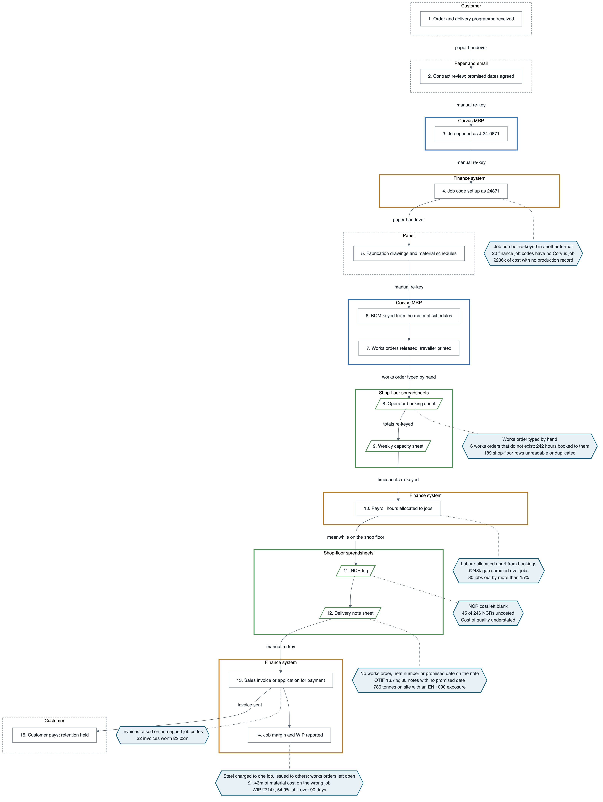
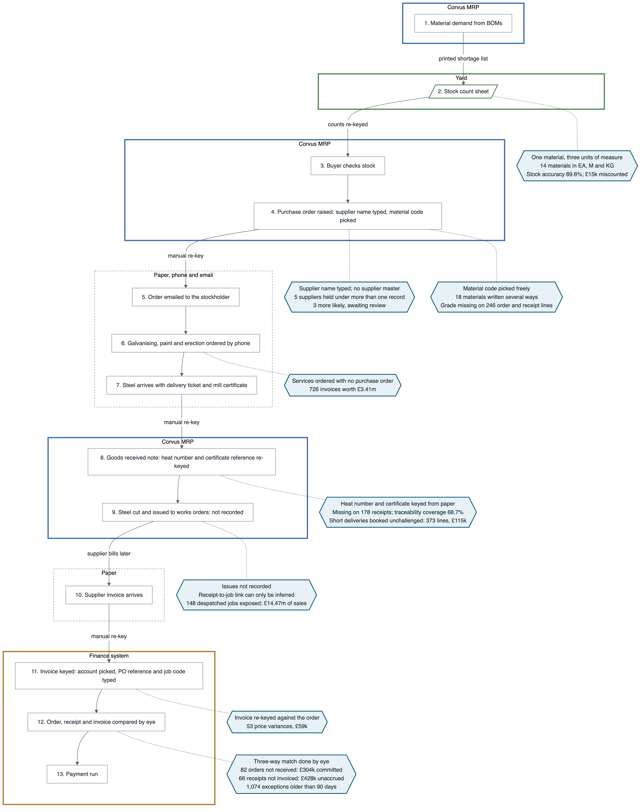
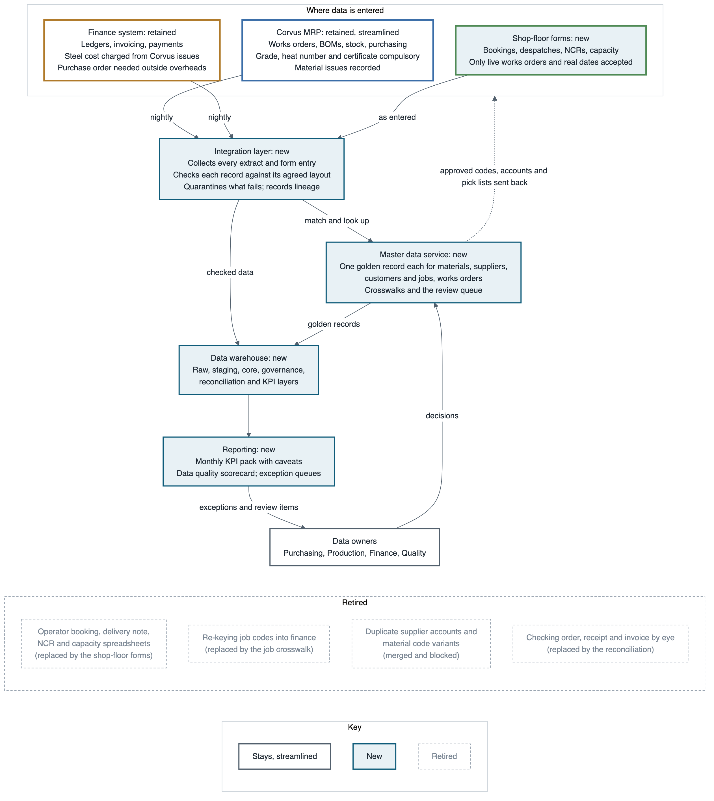

# Process maps and target architecture

**Demonstration prototype. All data is synthetic.** The company, its customers, suppliers and every
figure below are invented for the FabSync demonstrator. The figures are real in one sense: each is
measured by FabSync's reconciliation of that synthetic data, not estimated.

This document is generated by `make diagrams` from `docs/diagrams/templates/`. Diagram sources are in
`docs/diagrams/*.mmd` (Mermaid, a plain-text diagram language) and are rendered to `.svg` and `.png`
beside them.

## How to read the maps

A **process map** shows the steps a piece of work goes through, from the customer's order to the
money in the bank, and which system or piece of paper each step lives in.

- Each large box is a **system boundary**: everything inside it happens in one system, such as
  Corvus MRP, the finance system, a spreadsheet or on paper. Crossing a boundary means information
  has to move from one place to another.
- A line marked **manual re-key** is where someone reads information from one place and types it
  into another. Every re-key is a chance to mistype, and nothing checks the two copies agree.
- Slanted boxes are **spreadsheets**. They sit outside every system, so nothing controls what is
  typed into them.
- Shaded six-sided boxes are **break points**: places where the process loses information or lets
  two versions drift apart. Each names the defect it causes and what that defect measurably costs.

## Order to cash, as it is today

A customer order becomes a job in Corvus MRP, the manufacturing system that plans works orders,
material and stock. The same job is keyed again into the finance system under a different number
format. Drawings become a bill of material (BOM), the list of steel and fittings each assembly
needs, and the BOM becomes works orders. On the shop floor, operators book their hours against
works orders on spreadsheets. Supervisors log non-conformances (NCRs, records of defects and their
cost) and delivery notes on more spreadsheets. Finance raises invoices from the delivery notes and
allocates labour cost from payroll, separately from the hours operators booked.

| Break point | What happens | Defect it causes | Measured |
| --- | --- | --- | --- |
| Job set-up | Job J-24-0871 is typed into finance as 24871 | Finance jobs with no production record | 20 job codes; £236k of cost |
| Time booking | Works order numbers typed by hand on booking sheets | Hours booked to works orders that do not exist; unreadable rows | 6 works orders, 242 hours; 189 rows quarantined |
| Labour costing | Finance allocates payroll hours without reference to bookings | Labour cost on a job disagrees with hours worked | £248k across jobs; 30 jobs out by more than 15% |
| Despatch | Delivery notes carry no works order or heat number, and some no promised date | On-time delivery cannot be measured reliably, and traceability ends at the yard gate | OTIF 16.7%; 30 notes without a promised date; 1,103 tonnes despatched untraceable |
| NCRs | Cost of each defect typed into a log, often left blank | Cost of quality understated | 45 of 246 NCRs uncosted |
| Invoicing | Invoices raised on job codes Corvus does not hold | Revenue not tied to the work that earned it | 32 invoices, £2.02m |
| Job margin | Steel charged to one job but used on several; works orders left open | Wrong job margins; WIP overstated | £1.43m of material on the wrong job; WIP £714k, 54.9% over 90 days |

**OTIF** means on time, in full: the share of deliveries that arrived by the promised date with
everything on the lorry. **WIP**, work in progress, is the value of work started but not yet
delivered.

## Procure to pay, as it is today

Material demand comes from BOMs in Corvus. A buyer raises a purchase order (PO), typing the
supplier's name because Corvus has no supplier list, and picks a material code from several that
mean the same beam. Galvanising, painting and erection are often ordered by phone with no PO at all.
Steel arrives with a delivery ticket and a **mill certificate**, the steelmaker's record of the
steel's chemistry and strength. The **heat number** on it identifies the batch of steel it came
from. Goods-in type both references into a goods received note (GRN). When steel is cut for a job,
Corvus records nothing, so which delivery went into which job is not known. Finance keys each
supplier invoice by hand, picking one of several accounts for the same supplier. They then check
by eye that the order, the receipt and the invoice agree. This check is the **three-way match**.

| Break point | What happens | Defect it causes | Measured |
| --- | --- | --- | --- |
| Supplier | Supplier name typed on each order; separate accounts in finance | One supplier under several records | 5 confirmed, 3 more likely |
| Material code | Codes chosen freely; grade often left off | Same steel under several codes; grade unknown | 18 materials written several ways; 246 order and receipt lines without a grade |
| Units | Steel ordered in kg, stocked in bars, issued in metres | Stock cannot be reconciled | 14 materials in three units; stock accuracy 89.6%, £15k miscounted |
| Services | Galvanising, paint, erection ordered by phone | Spend with no order to check the invoice against | 726 invoices, £3.41m |
| Goods-in | Heat number and certificate typed from paper | Steel that cannot be traced to its certificate | 178 receipts; traceability coverage 68.7% |
| Issue to job | Nothing recorded | Which steel went into which job can only be inferred | 148 despatched jobs exposed; £14.47m of sales on them |
| Receipt | Short deliveries booked without challenge | Paying for steel not received, or not noticing it | 373 lines, £115k |
| Invoice entry | Invoice typed against the order by hand | Overcharges paid | 53 price variances, £59k |
| Three-way match | Done by eye, when there is time | Orders never received; receipts never invoiced | 82 orders, £304k committed; 66 receipts, £428k unaccrued; 1,074 older than 90 days |

## The target: one integrated ecosystem

The target keeps the systems the business runs on and removes the gaps between them.

- The **integration layer** is the set of scheduled jobs and checks that collect data from each
  system every night, and from the shop-floor forms as it is entered. It checks every record
  against that system's agreed layout, quarantines what fails and records where every row went.
  FabSync's ingestion already does this.
- The **master data service** is the single place that decides what a material, supplier,
  customer, job or works order is called. It issues the **golden record**: the one agreed version
  of each, built from all the systems' copies by stated rules. It sends approved codes back to
  Corvus and finance. FabSync's matching already does the deciding.
- The **data warehouse** is a separate database that holds a copy of everything, organised for
  reporting, so reports never slow down or change the working systems.
- **Reporting** is the management pack, the data quality scorecard, and the exception queues that
  tell each owner what to fix.

| Component | Status | What changes |
| --- | --- | --- |
| Corvus MRP | Stays, streamlined | Grade, heat number and certificate become compulsory; material issues are recorded; material and supplier codes only come from the master data service |
| Finance system | Stays | Supplier accounts only come from the master data service; steel cost is charged to jobs from Corvus issues; a PO is needed for all spend except overheads |
| Shop-floor forms | New | Replace booking, delivery note, NCR and capacity spreadsheets; accept only live works orders and real dates |
| Integration layer | New | Nightly collection with checks, quarantine and lineage |
| Master data service | New | Golden records, crosswalks and the review queue |
| Data warehouse | New | Raw, staging, core, governance, reconciliation and KPI layers |
| Reporting | New | KPI pack, scorecard, exception queues to data owners |
| Booking, delivery, NCR and capacity spreadsheets | Retired | Replaced by the forms |
| Re-keying job codes and invoices | Retired | Crosswalk and matching replace it |
| Duplicate supplier accounts, material code variants | Retired | Merged and blocked |

How the systems exchange data, who owns each exchange, and which system wins when copies disagree
are set out in `docs/integration-design.md`. Who owns each kind of data, and what happens when a
disagreement cannot be settled automatically, is in `docs/data-ownership.md`.
